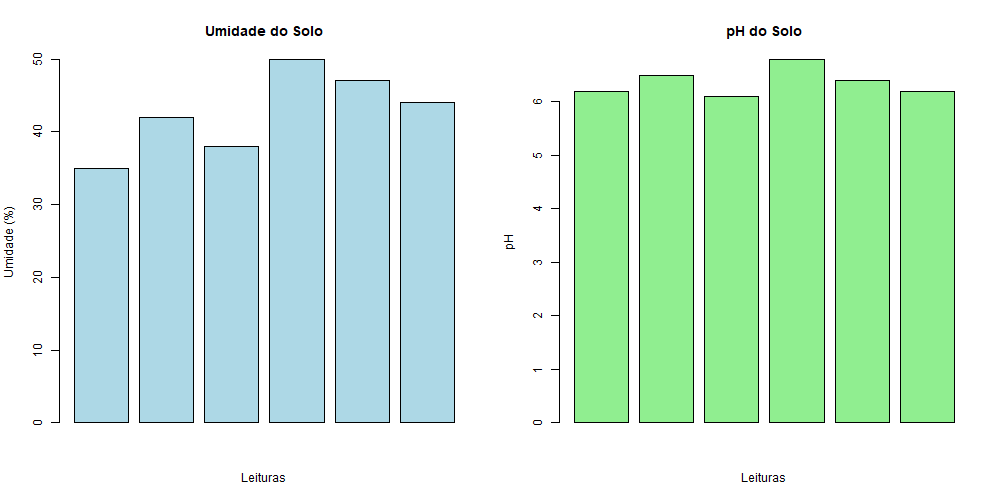

#  FarmTech Solutions

Projeto de irrigação inteligente utilizando ESP32, Python e análise de dados em R.

---

##  Funcionamento

O sistema monitora a umidade do solo e utiliza dados climáticos em tempo real para tomar decisões automáticas sobre irrigação.

---

##  Integração com API

Foi utilizada a API **OpenWeather** para obter dados climáticos em tempo real.

Com base nesses dados:
- Se houver previsão de chuva → NÃO irrigar  
- Se não houver chuva → irrigar  

---

##  Python

O script `weather.py` realiza:

- Consulta à API OpenWeather  
- Retorno de:
  - Clima atual  
  - Temperatura  
  - Decisão de irrigação  

---

##  Análise em R

O script `analise.R` realiza:

- Cálculo de média, mediana e desvio padrão da umidade  
- Análise do pH do solo  
- Correlação entre variáveis  
- Geração de gráfico  
- Decisão de irrigação com base nos dados  

---

##  Gráfico Gerado

O sistema gera automaticamente o seguinte gráfico:

---

##  ESP32

O ESP32 simula o controle de irrigação com base nos dados dos sensores.

---

##  Vídeo

(Em produção — será adicionado pelo Kaio)

---

##  Integrantes

- Jonattas Felipe Pereira Barbosa — RM572692  
- Gilenisson Santos — RM573716  
- Kaio Rocha — RM573509  
- Felipe dos Santos Lofrano — RM570019  
- Natanael Filho — RM572474  
- Bruna Camila — RM573402  

---

##  Conclusão

O projeto demonstra a integração entre dados climáticos, análise estatística e automação para criar um sistema de irrigação inteligente, contribuindo para o uso eficiente de recursos na agricultura.